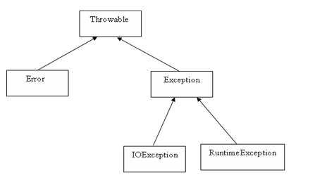
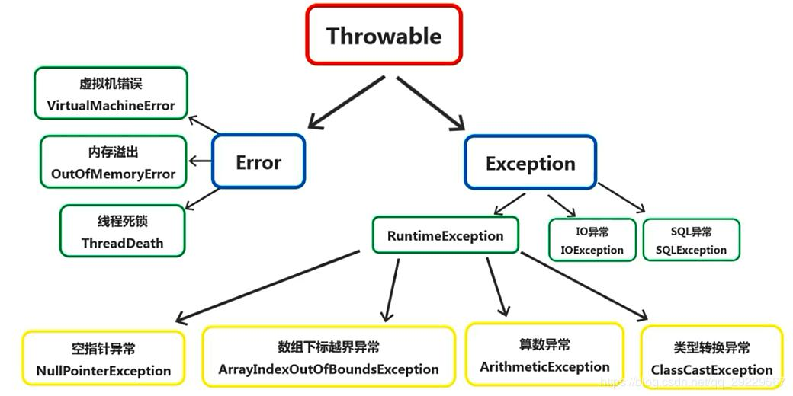

## java的异常处理






在java程序设计语言中，异常对象都是派生于Throwable类的一个实例。

所有的异常都是有Throwable继承而来

**Error** 类层次结构描述了 **Java** 运行时系统的内部错误和资源耗尽错误。 应用程序不应该抛出这种类型的对象。 如果出现了这样的内部错误， 除了通告给用户，并尽力使程序安全地终止之外， 再也无能为力了。这种情况很少出现

在设计 **Java** 程序时， 需要关注 **Exception** 层次结构。 这个层次结构又分解为两个分支：一个分支派生于 **RuntimeException** ; 另一个分支包含其他异常。划分两个分支的规则是：由程序错误导致的异常属于 **RuntimeException** ; 而程序本身没有问题， 但由于像 **I**/**O** 错误这类问题导致的异常属于其他异常

Java 语 言 规 范 将 派 生 于 Error 类 或 RuntimeException 类的所有异常称为非受查( unchecked ) 异常，所有其他的异常称为受查（ checked) 异常。

### 抛出异常

```
throws:声明异常，跟在方法名的后面
throw:手动抛异常  ，写在方法内部，能够自成一行。     
throw跟throws要配合使用。
throws可以单独使用。 
```

### 创建异常类

定义一个派生于Exception 的类，或者派生于 Exception 子类的类。例如， 定义一个派生于 IOException 的类。习惯上， 定义的类应该包含两个构造器， 一个是默认的构造器；另一个是带有详细描述信息的构造器（超类 Throwable 的 toString 方法将会打印出这些详细信息， 这在调试中非常有用)。

### 捕获异常

要想捕获一个异常， 必须设置 try/catch/finally语句块。

try 语句可以只有 finally 子句，而没有 catch 子句,也可以只有catch而没有finally

```
try
{
more code
}
catch (ExceptionType e)
{
handlerfor this type
}
finally{
}
```

