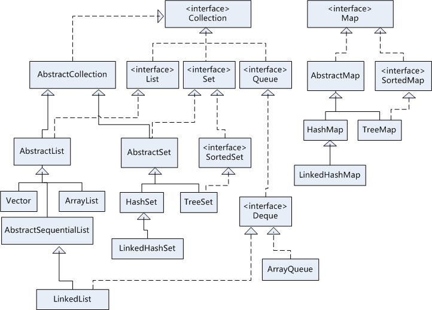
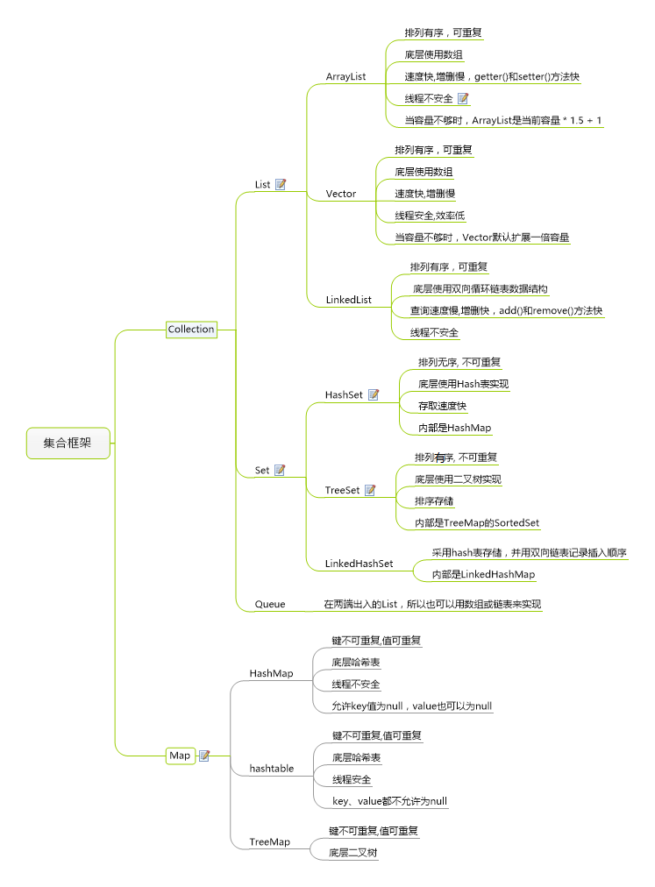

# 集合体系



List： 有序（数据存储有序），可以多个元素引用相同的对象
Set： 无序，不重复，不可以多个元素引用相同对象

Queue：先入先出FIFO队列，可以重复对象

Map： 使用键值对存储，两个key可以引用相同的对象，但是key不能重复


## list接口

List 接口  List接口是一个有序的 Collection，使用此接口能够精确的控制每个元素插入的位置，能够通过索引(元素在List中位置，类似于数组的下标)来访问List中的元素，第一个元素的索引为 0，而且允许有相同的元素。 List 接口存储一组不唯一，有序（插入顺序）的对象。    

##### 常用实现类

| 1    | LinkedList  该类实现了List接口，允许有null（空）元素。主要用于创建链表数据结构，该类没有同步方法， LinkedList 修改和查找效率低。 |
| ---- | ------------------------------------------------------------ |
| 2    | ArrayList  该类也是实现了List的接口，实现了可变大小的数组，随机访问和遍历元素时，提供更好的性能。该类也是非同步的,在多线程的情况下不要使用。ArrayList插入删除效率低。 |
| 3    | Vector   该类和ArrayList非常相似，但是该类是同步的，可以用在多线程的情况，该类允许设置默认的增长长度，默认扩容方式为原来的2倍。 |
| 4    | Stack   栈是Vector的一个子类，它实现了一个标准的后进先出的栈。 |

```
 List 有序,可重复

ArrayList
优点: 底层数据结构是数组，查询快，增删慢。
缺点: 线程不安全，效率高
Vector
优点: 底层数据结构是数组，查询快，增删慢。
缺点: 线程安全，效率低
LinkedList
优点: 底层数据结构是链表，查询慢，增删快。
缺点: 线程不安全，效率高
```


## set接口

Set 具有与 Collection 完全一样的接口，只是行为上不同，Set 不保存重复的元素。

Set 接口存储一组唯一，无序的对象。

##### 实现类

| 1    | HashSet  该类实现了Set接口，不允许出现重复元素，不保证集合中元素的顺序，允许包含值为null的元素，但最多只能一个。 |
| ---- | ------------------------------------------------------------ |
| 2    | LinkedHashSet的主要功能用于保证FIFO即有序的集合              |
| 3    | TreeSet  该类实现了Set接口，可以实现排序等功能。树集是一个有序集合，可以以任意顺序将元素插入到集合中在对集合进行遍历时，每个值将自动地按照排序后的顺序呈现。 |

```
Set    无序,唯一

HashSet
底层数据结构是哈希表。(无序,唯一)
如何来保证元素唯一性?
1.依赖两个方法：hashCode()和equals()

LinkedHashSet
底层数据结构是链表和哈希表。(FIFO插入有序,唯一)
1.由链表保证元素有序
2.由哈希表保证元素唯一

TreeSet
底层数据结构是红黑树。(唯一，有序)
1.如何保证元素排序的呢?
自然排序
比较器排序
2.如何保证元素唯一性的呢?
根据比较的返回值是否是0来决定
```

###### 方法

| Modifier and Type     | Method and Description                                       |
| :-------------------- | :----------------------------------------------------------- |
| `boolean`             | `add(E e)` 确保此集合包含指定的元素（可选操作）。            |
| `boolean`             | `addAll(Collection c)` 将指定集合中的所有元素添加到此集合（可选操作）。 |
| `void`                | `clear()` 从此集合中删除所有元素（可选操作）。               |
| `boolean`             | `contains(Object o)` 如果此集合包含指定的元素，则返回 `true` 。 |
| `boolean`             | `containsAll(Collection c)` 如果此集合包含指定 `集合`中的所有元素，则返回true。 |
| `boolean`             | `equals(Object o)` 将指定的对象与此集合进行比较以获得相等性。 |
| `int`                 | `hashCode()` 返回此集合的哈希码值。                          |
| `boolean`             | `isEmpty()` 如果此集合不包含元素，则返回 `true` 。           |
| `Iterator`            | `iterator()` 返回此集合中的元素的迭代器。                    |
| `default Stream`      | `parallelStream()` 返回可能并行的 `Stream`与此集合作为其来源。 |
| `boolean`             | `remove(Object o)` 从该集合中删除指定元素的单个实例（如果存在）（可选操作）。 |
| `boolean`             | `removeAll(Collection c)` 删除指定集合中包含的所有此集合的元素（可选操作）。 |
| `default boolean`     | `removeIf(Predicate filter)` 删除满足给定谓词的此集合的所有元素。 |
| `boolean`             | `retainAll(Collection c)` 仅保留此集合中包含在指定集合中的元素（可选操作）。 |
| `int`                 | `size()` 返回此集合中的元素数。                              |
| `default Spliterator` | `spliterator()` 创建一个[`Spliterator`](https://www.matools.com/file/manual/jdk_api_1.8_google/java/util/Spliterator.html)在这个集合中的元素。 |
| `default Stream`      | `stream()` 返回以此集合作为源的顺序 `Stream` 。              |
| `Object[]`            | `toArray()` 返回一个包含此集合中所有元素的数组。             |
| ` T[]`                | `toArray(T[] a)` 返回包含此集合中所有元素的数组; 返回的数组的运行时类型是指定数组的运行时类型。 |


## queue接口

Queue用于模拟队列数据结构，采用“先进先出”的方式

##### 常用实现类

| 1    | PriorityQueue 优先级队列 ，是一种允许高效删除最小元素的集合， |
| ---- | ------------------------------------------------------------ |
| 2    | ArrayDeque是一种用循环数组实现的双向队列                     |
| 3    | LinkedList类是List接口的实现类，但是同时也是Deque接口实现类（Deque是queue的子接口），所以LinkedList既可以当做双端队列来使用，也可以当做栈来使用 |

###### 方法

| Modifier and Type | Method and Description                                       |
| :---------------- | :----------------------------------------------------------- |
| `boolean`         | `add(E e)` 将指定的元素插入到此队列中，如果可以立即执行此操作，而不会违反容量限制， `true`在成功后返回 `IllegalStateException`如果当前没有可用空间，则抛出IllegalStateException。 |
| `E`               | `element()` 检索，但不删除，这个队列的头。                   |
| `boolean`         | `offer(E e)` 如果在不违反容量限制的情况下立即执行，则将指定的元素插入到此队列中。 |
| `E`               | `peek()` 检索但不删除此队列的头，如果此队列为空，则返回 `null` 。 |
| `E`               | `poll()` 检索并删除此队列的头，如果此队列为空，则返回 `null` 。 |
| `E`               | `remove()` 检索并删除此队列的头。                            |


## map接口

Map 接口存储一组键值对象，提供key（键）到value（值）的映射。

##### 常用实现类

| 1    | HashMap   HashMap 是一个散列表，它存储的内容是键值对(key-value)映射。  该类实现了Map接口，根据键的HashCode值存储数据，具有很快的访问速度，最多允许一条记录的键为null，不支持线程同步。 |
| ---- | ------------------------------------------------------------ |
| 2    | TreeMap   继承了AbstractMap，TreeMap是有序的，键不能为空。   |
| 3    | WeakHashMap   继承AbstractMap类，WeakHashMap是一种改进的HashMap，它对key实行“弱引用”，如果一个key不再被外部所引用，那么该key可以被GC回收。。 |
| 4    | LinkedHashMap   继承于HashMap，使用元素的自然顺序对元素进行排序,key和value都允许空，有序线程不安全；LinkedHashMap可以认为是**HashMap+LinkedList**，即它既使用HashMap操作数据结构，又使用LinkedList维护插入元素的先后顺序。 |
| 5    | IdentityHashMap   继承AbstractMap类，在IdentityHashMap中，是判断key是否为同一个对象，而不是普通HashMap的equals方式判断。 |

```
TreeMap和HashMap选择

排序：排序的时候用TreeMap，其他用HashMap。


LinkedHashMap和HashMap选择

FIFO:插入迭代顺序一致用LinkedHashMap，其他用HashMap

LinkedHashMap 继承HashMap底层链表结构，插入顺序与迭代顺序一致


Hashtable（弃用）

线程安全，不推荐使用，使用ConcurrentHashMap代替多线程场景，性能更好。


ConcurrentHashMap

多线程

```


###### 方法

- - | Modifier and Type | Method and Description                                       |
    | :---------------: | ------------------------------------------------------------ |
    |      `void`       | `clear()` 从该地图中删除所有的映射（可选操作）。             |
    |    `default V`    | `compute(K key, BiFunction remappingFunction)` 尝试计算指定键的映射及其当前映射的值（如果没有当前映射， `null` ）。 |
    |    `default V`    | `computeIfAbsent(K key, Function mappingFunction)` 如果指定的键尚未与值相关联（或映射到 `null` ），则尝试使用给定的映射函数计算其值，并将其输入到此映射中，除非 `null` 。 |
    |    `default V`    | `computeIfPresent(K key, BiFunction remappingFunction)` 如果指定的密钥的值存在且非空，则尝试计算给定密钥及其当前映射值的新映射。 |
    |     `boolean`     | `containsKey(Object key)` 如果此映射包含指定键的映射，则返回 `true` 。 |
    |     `boolean`     | `containsValue(Object value)` 如果此地图将一个或多个键映射到指定的值，则返回 `true` 。 |
    |      `Set>`       | `entrySet()` 返回此地图中包含的映射的[`Set`](../../java/util/Set.html)视图。 |
    |     `boolean`     | `equals(Object o)` 将指定的对象与此映射进行比较以获得相等性。 |
    |  `default void`   | `forEach(BiConsumer action)` 对此映射中的每个条目执行给定的操作，直到所有条目都被处理或操作引发异常。 |
    |        `V`        | `get(Object key)` 返回到指定键所映射的值，或 `null`如果此映射包含该键的映射。 |
    |    `default V`    | `getOrDefault(Object key, V defaultValue)` 返回到指定键所映射的值，或 `defaultValue`如果此映射包含该键的映射。 |
    |       `int`       | `hashCode()` 返回此地图的哈希码值。                          |
    |     `boolean`     | `isEmpty()` 如果此地图不包含键值映射，则返回 `true` 。       |
    |       `Set`       | `keySet()` 返回此地图中包含的键的[`Set`](../../java/util/Set.html)视图。 |
    |    `default V`    | `merge(K key, V value, BiFunction remappingFunction)` 如果指定的键尚未与值相关联或与null相关联，则将其与给定的非空值相关联。 |
    |        `V`        | `put(K key, V value)` 将指定的值与该映射中的指定键相关联（可选操作）。 |
    |      `void`       | `putAll(Map m)` 将指定地图的所有映射复制到此映射（可选操作）。 |
    |    `default V`    | `putIfAbsent(K key, V value)` 如果指定的键尚未与某个值相关联（或映射到 `null` ）将其与给定值相关联并返回 `null` ，否则返回当前值。 |
    |        `V`        | `remove(Object key)` 如果存在（从可选的操作），从该地图中删除一个键的映射。 |
    | `default boolean` | `remove(Object key, Object value)` 仅当指定的密钥当前映射到指定的值时删除该条目。 |
    |    `default V`    | `replace(K key, V value)` 只有当目标映射到某个值时，才能替换指定键的条目。 |
    | `default boolean` | `replace(K key, V oldValue, V newValue)` 仅当当前映射到指定的值时，才能替换指定键的条目。 |
    |  `default void`   | `replaceAll(BiFunction function)`  将每个条目的值替换为对该条目调用给定函数的结果，直到所有条目都被处理或该函数抛出异常。 |
    |       `int`       | `size()` 返回此地图中键值映射的数量。                        |
    |  `Collection`<v>  | `values()` 返回此地图中包含的值的[`Collection`](../../java/util/Collection.html)视图。 |


## 总结

